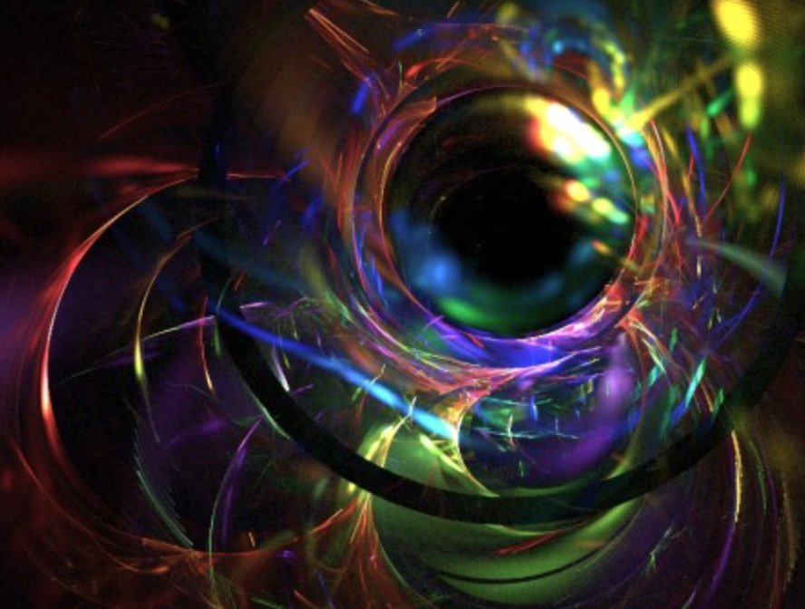
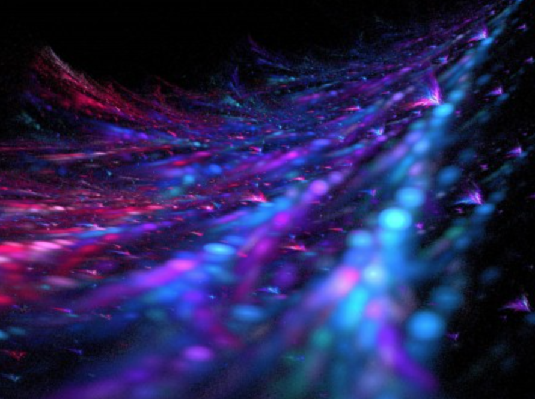
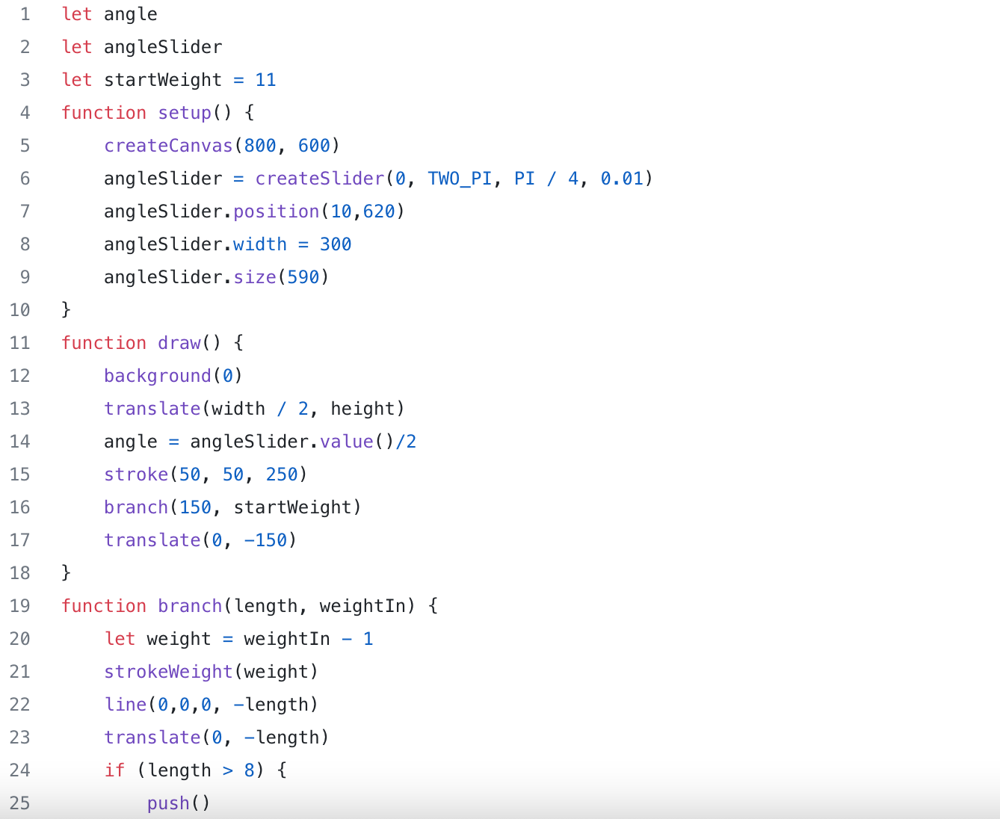
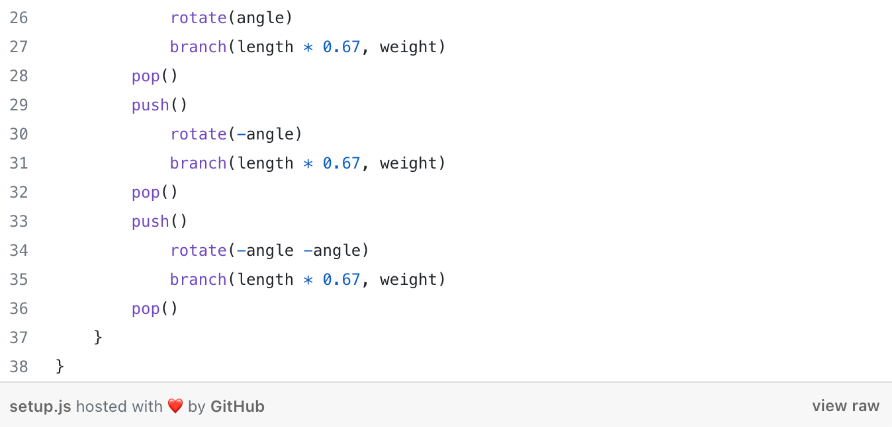

# yiwu0288_9103_tut1

## Part 1: Imaging Technique Inspiration
I discovered fractal art, an algorithmic art form created by calculating fractal objects and representing the results of the calculations as still images, animations, and media. Fractals are complex patterns that are self-similar at different scales, meaning they are created by repeating a simple process over and over in an ongoing feedback loop. I can use fractal art to explore the beauty and complexity of mathematics, nature, and geometry. I can experiment with different parameters, colors, shapes, and transformations to create unique and diverse artwork. I can also combine fractal art with other technologies such as sound, interactivity, or animation to enhance the functionality and expressiveness of coding projects.

## Part 2: Coding Technique Exploration
For coding tips on fractal art, you can use recursive functions to generate fractal graphics. A recursive function is a function that calls itself in its own definition, which can achieve infinite iterations and self-similarity characteristics of fractals. You can use recursive functions to draw various geometric fractals, such as Koch snowflakes, Sierpinski triangles, dragon curves, etc. You only need to define a basic graphics unit and an iteration rule, and then let the function call itself repeatedly. Generate complex and beautiful fractal patterns.This is an example of [drawing *Koch snowflake* with recursions](https://betterprogramming.pub/learning-p5-js-by-making-fractals-cbdcac5c651e).The Koch Snowflake is a fractal pattern consisting of three Koch curves, each of which is formed by a continuous transformation of a straight line segment. This program uses the line() and rotate() functions provided by p5.js to draw the Koch curve, and uses a recursive function to repeat the process. This program also uses the mouseX variable to control the depth of the Koch curve to achieve interactive effects.

